# Self Driving RC Car

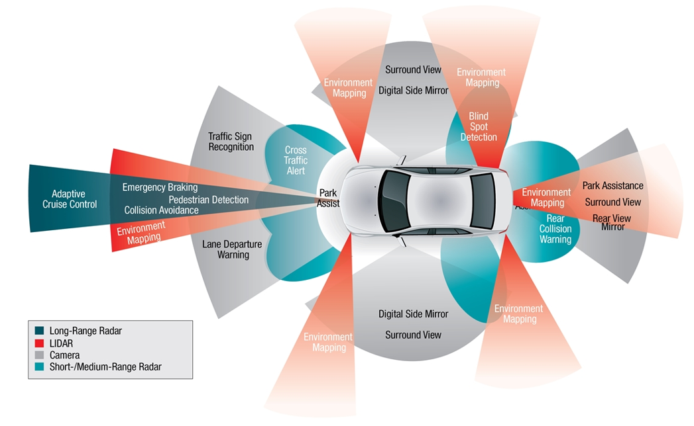

Ref: Sensor technology used in a self-driving car (https://goo.gl/cV4dWx)

## Outline:  
- Description Of The Project  
- Approach  
- CNN Model Evaluation With Different Parameters  
- Results With VGG16 Model  
- Deep Metric Learning: Finding Visually Similar Images  
- Generative Adversarial Network (GAN): Generating Similar Images  
- Mask rCNN: Image Segmentation  

## Description Of The Project  
- This project is an attempt to build a self driving miniature car using raspberry Pi, remote controlled toy car and a pi camera.  
- The goal is to make the car drive on its own, i.e. follow a lane on its own without any external guidance.  
- In this project, two approaches were used to achieve the ‘self-driving’ behavior:  
 - Approach 1: Computer vision and pixel analysis 
 - Approach 2: Convolutional neural network (CNN)

## Components and Circuitry
- Main Components  
 - RC car  
 - Raspberry Pi  
 - Raspberry Pi Camera  
 - L293D  
 - Batteries for Raspberry Pi and for the RC car  

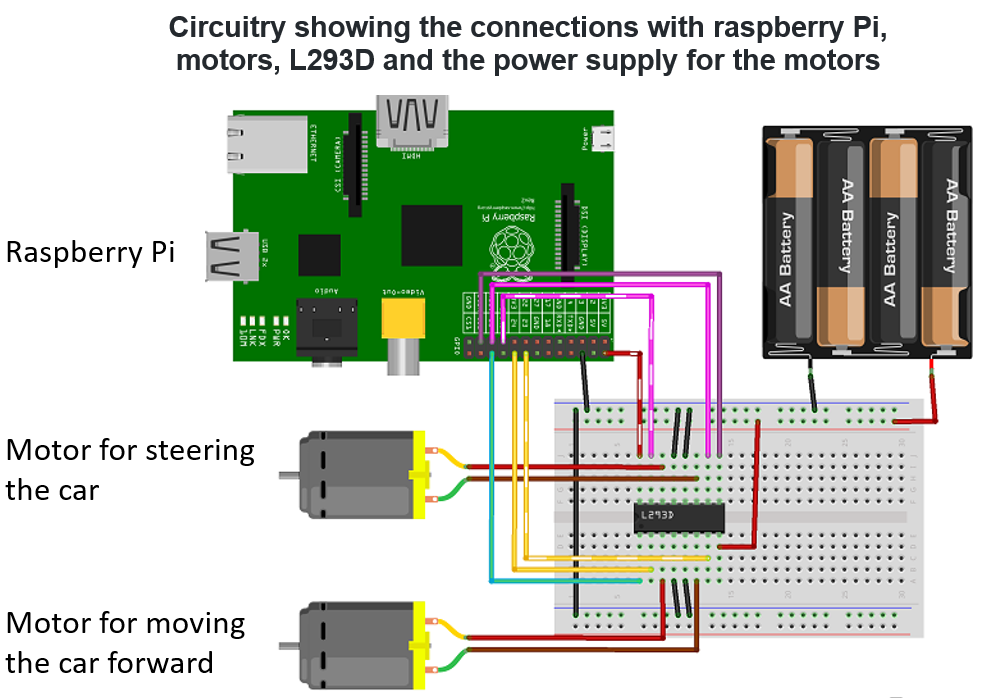

Ref: https://business.tutsplus.com/tutorials/controlling-dc-motors-using-python-with-a-raspberry-pi--cms-20051

## Approach 1: 
### Computer Vision and Pixel Analysis  
- In approach 1, OpenCV was used for image manipulations and making the predictions whether the car would turn left or right.  
- The idea is to make the car follow a path defined by a single line (a painter's tape in this case).  
- Firstly, the image captured from the camera stream is converted to a grayscale image, followed by conversion to a binary image (thresholding). Then, the number of white pixels are counted for the left half and the right half of the image.
- As shown in the images below, if the number of white pixels are lower on the left half of the image, the car would turn left and likewise for the right turn.

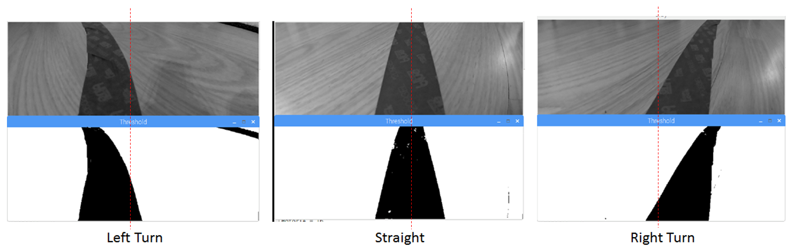

Grayscaled and thresholded images of left turn, straight path and right turn  

### The Car In Action  
- The GIF below shows the car in action. 
- It can be seen that the car is able to make left and right turns with decent precision and it is able to follow the given path.  

  
- Approach 2 involves the use of a custom convolutional neural network (CNN) model. 
- The model was created using Keras (with TensorFlow backend), and trained on a CPU. This model and pretrained weights are then used in the raspberry Pi to make predictions and steer the car.
- Model performance was analyzed for different parameters such as number of convolution layers, number of hidden layers, regularization, data size, optimizers, etc. The results are discussed below.  

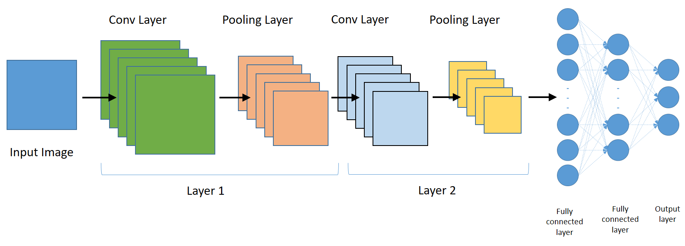

Schematic of the custom CNN model

### Three Classes For The CNN Model  
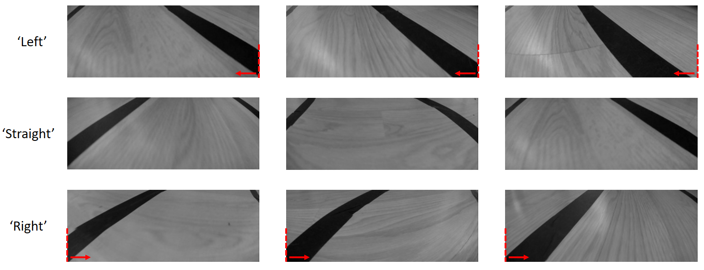

##### The CNN model was trained for 3 classes: ‘Left’, ‘Straight’ and ‘Right’. The following criteria was used to label the images:  
- ‘Left’: any image with the black tape touching and extending towards the left of the bottom right corner.
- ‘Right’: any image with the black tape touching and extending towards the right of the bottom left corner.
- ‘Straight’: any intermediate images that do not satisfy the above two criteria.

### The Car In Action  
- The video to the right shows the car in action, running on the custom CNN model. 
- It can be seen that the car is able to make the right turn when it detects the lane curving to the right. Somehow, the car is able to make right turns more accurately compared to left turns (not shown here).

 optimizer.

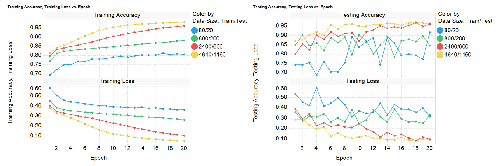

#### Optimizers
- With the use Adam optimizer, the model gives better training results compared to SGD and RMSprop optimizer. 
- For test dataset, although all three optimizers result in similar accuracy for higher epochs, the loss with SGD optimizer is lower.

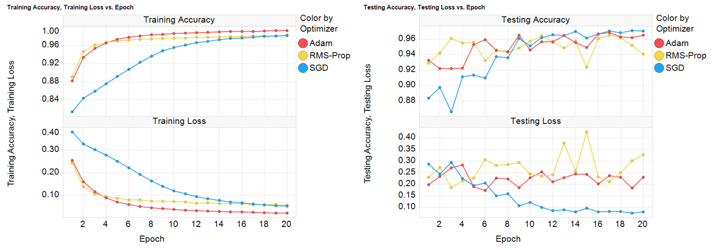

#### Number of hidden layers
As shown below, the number of hidden layers do not seem to matter for the custom model, as the training and testing losses do not change much with the number of hidden layers.

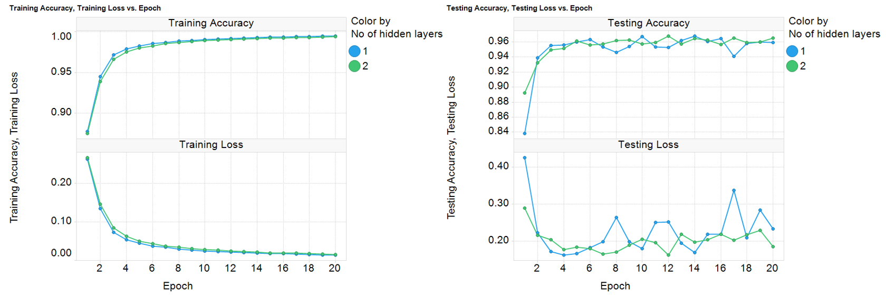

#### Number of convolution layers
- Having 2 convolution layers improves accuracy of both training set and test set compared to those with only 1 convolution layer. The training loss is also improved. However, there is no further improvement observed with 3 convolution layers.
- Note: it can be seen that the test loss increases with the number of epochs when the number of convolution layers is increased. This seems to indicate that there is overfitting in the model. A closer look at the test accuracy with 3 convolution layers shows a slight degradation in the accuracy after 13 epochs. This can be fixed with ‘Dropout’ as shown in the next slide.

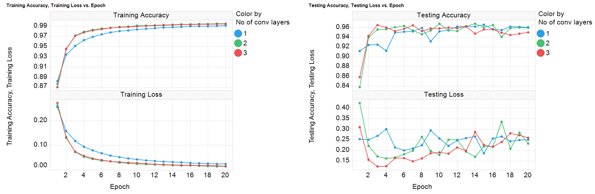

#### Dropout Regularization
- Adding dropout regularization to the model increases test accuracy and reduces test loss.
- However, as expected, it degrades training accuracy and increases training loss.

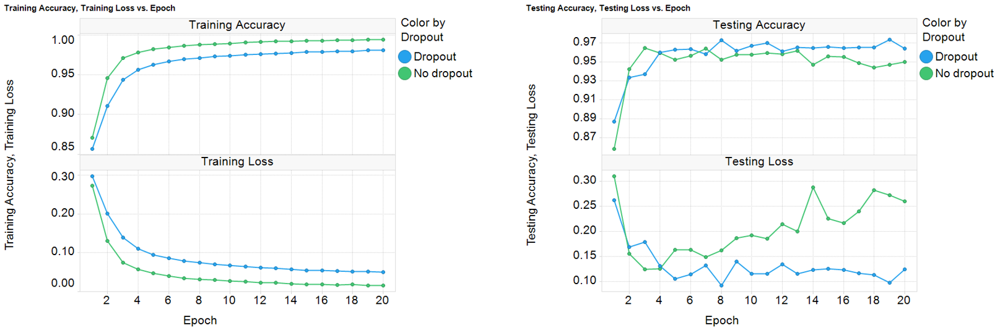

#### L2 Regularization
- Introducing L2 regularization in the dense layer (hidden layer before the final layer) also resulted in bringing down the test loss for higher number of epochs. 
- L2 regularization for the convolution layer showed very small improvement. 
- For training dataset, both accuracy and loss were degraded with the introduction of L2 regularization.

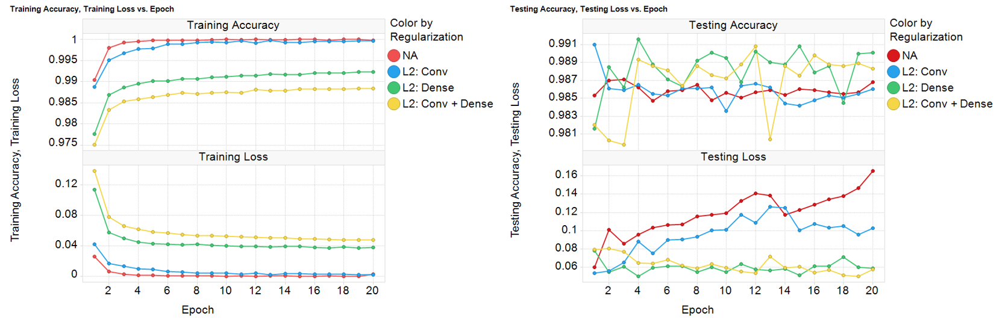

#### Image Augmentation: Shear, zoom, flip
- Keras has a deep learning library called ‘ImageDataGenerator’ ([link](https://keras.io/preprocessing/image/)) that helps with data augmentation (increasing the available data) by applying shear, zoom, flips, etc. to the training images (a model trained on a larger dataset usually performs better). 
- However, in my case, the application of zoom and horizontal flips resulted in poor training and testing performance because of the criteria (discussed earlier) used for labeling the images. Why application of zoom and horizontal flips result in poor training and testing performance is discussed below.

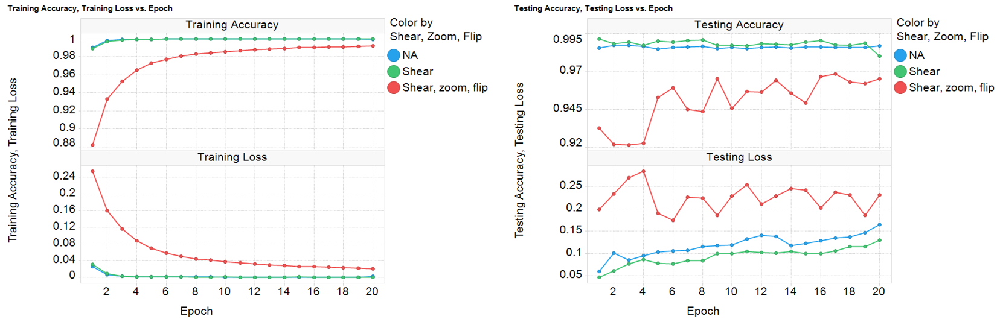

#### Issues with ‘Zoom’
- As shown in the examples below, depending on where the zoom is applied, the generated images could be wrongly labeled. 
- This would complicate the training and lead the model to classify the images incorrectly.

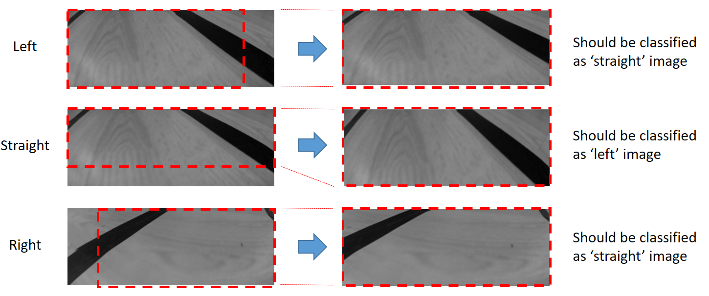

#### Issues with ‘Horizontal Flip’
- Flip: As shown in the examples below, when flipped horizontally, a ‘left’ image would look like a ‘right’ image and vice versa.
- This would complicate the training and lead the model to classify the images incorrectly.

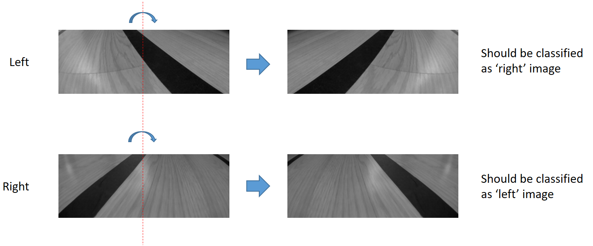

### Results With VGG16 Model
- The results discussed so far are with the custom CNN model with only a few convolution and hidden layers.
- Another common approach to solve a classification problem is to use a pretrained model such as VGG16, VGG19, Inception, Resnet50, etc. Also known a transfer learning approach.
- The benefit of using these models is that these models are trained on millions of images with thousands of classes (ImageNet dataset ([link](http://www.image-net.org/about-stats))) and they have performed well in the ImageNet challenge ([link](https://paperswithcode.com/sota/image-classification-on-imagenet
)). 
- Transfer learning using VGG16 (fine tuned) was used for the images collected in this project and compared with the custom model (with parameters that show the best results). 
- It can be seen that even with the optimized parameters, the custom model’s training performance is slightly worse than VGG16, whereas test performance looks comparable (although test loss appears to increase with number of epochs for VGG16 model, indicating the possibility of overfitting).

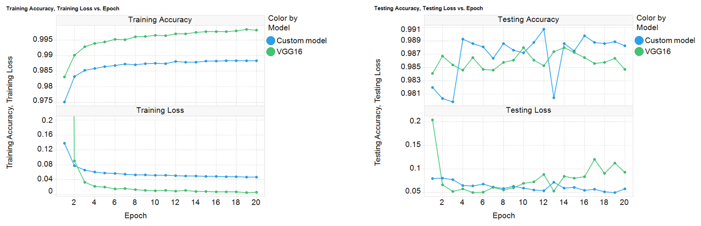

#### Fine Tuned VGG16 Model: tSNE Visualization
- As mentioned earlier, although we use pretrained weights for the VGG16 model, fine tuning of the model is usually done to make the model converge.
- Below images show tSNE plots ([link](http://www.jmlr.org/papers/volume9/vandermaaten08a/vandermaaten08a.pdf)) for the fine tuned model. It can be seen that similar images from a class are clustered together indicating good convergence of the model (although some edge cases where images belonging ‘straight’ class can be seen overlapping with ‘right’ and ‘left’ classes). 
- The plot on the right shows another tSNE plot with images shown on the plot itself providing a better visualization of how the images are clustered.

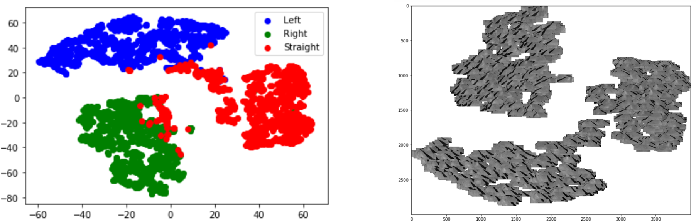

### Finding Visually Similar Images
Finding visually similar image (or image retrieval) is a technique where the model outputs images visually similar to the query image provided by the user. It is commonly used by companies such Pinterest, Amazon, etc. for finding similar products ([link1](http://www.jmlr.org/papers/volume11/chechik10a/chechik10a.pdf), [link2](https://www.oreilly.com/library/view/practical-deep-learning/9781492034858/ch04.html)).
Here transfer learning (with fine tuned VGG16 network) was tested to see if images similar to the query image could be retrieved. The resulting images are returned based on KNN (k-nearest neighbor algorithm).

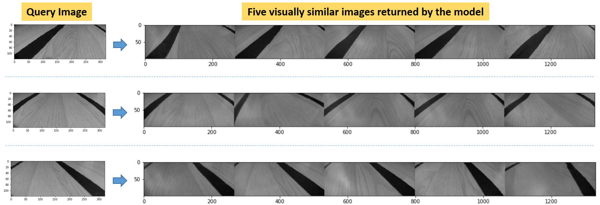

### Generative Adversarial Network (GAN): Generating Similar Images
- Generative Adversarial Network (GAN), is a generative modeling technique, involving generating new examples that come from an existing distribution of samples ([link1](http://papers.nips.cc/paper/5423-generative-adversarial-nets.pdf), [link2](https://machinelearningmastery.com/impressive-applications-of-generative-adversarial-networks/)). Applications of GAN include generating realistic human faces, image to image translation, text to image translation, etc.
- In this project, GAN technique was tested to create images similar to those used earlier for training the custom CNN model.
- As shown below, GAN does fairly well in creating images similar to the input images.

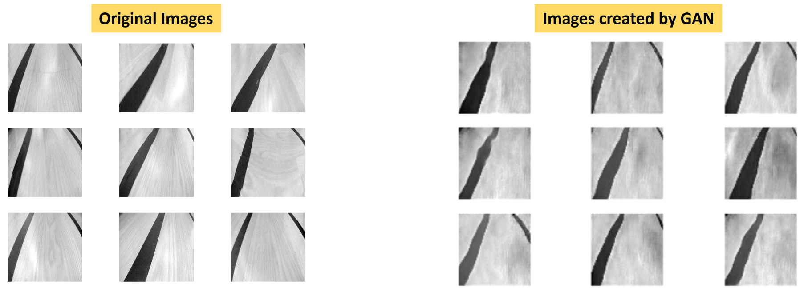

### Mask rCNN: Image Segmentation
- Here instance segmentation with Mask R-CNN is implemented, which is largely inspired by Matterport ([link](https://github.com/matterport/Mask_RCNN)) that uses RESNET and feature pyramid network (FPN) as the backbone for training and testing the images dataset.
- 80 annotated images for training and 20 annotated images for testing were used with pretrained weights from the COCO dataset ([link](http://cocodataset.org)), and with two classes: ‘Path’ and ‘Background’.
- As we can see, the model detects paths fairly well but there are still edges with curvy lines and rounded corners. These are some initial results and more work is needed to make the model perform better.

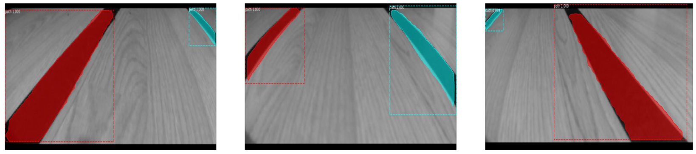

## Summary
- This project attempts to build a self driving miniature car using raspberry Pi and a remote controlled toy car.
- With the two approaches (computer vision/pixel analysis and CNN model) tested here, the car performs decently well in following a predefined lane.
- Different parameters were optimized to improve the performance of the custom CNN model, which brings the training and test accuracy close to 99%. 
- Various techniques such as transfer learning, tSNE visualization, generative adversarial network (GAN) and Mask r-CNN were also tested with the dataset, which yield good results.
- However, it should be noted that the dataset consists of very simple images (mostly containing straight lines), so getting good results with the limited training with different techniques is expected. The goal here was to understand the underlying concepts (behind CNN, parameter optimizations, visualizations, transfer learning, GAN, mask r-CNN, etc.) such that the understandings could be expanded to a more complex dataset.

#### Acknowledgments:
[https://github.com/hamuchiwa/AutoRCCar](https://github.com/hamuchiwa/AutoRCCar)  
[https://github.com/RyanZotti/Self-Driving-Car](https://github.com/RyanZotti/Self-Driving-Car)  
[https://becominghuman.ai/building-self-driving-rc-car-series-1-intro-equipments-plan-8d9f579df45c](https://becominghuman.ai/building-self-driving-rc-car-series-1-intro-equipments-plan-8d9f579df45c)

